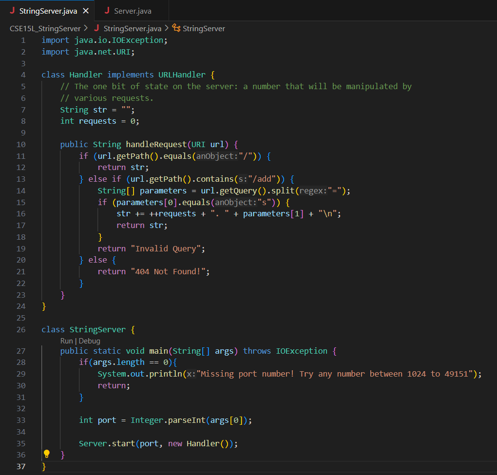
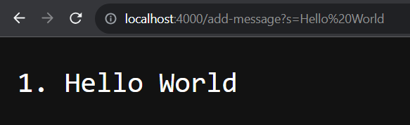
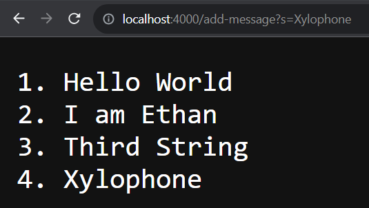
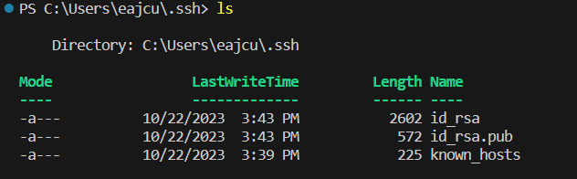
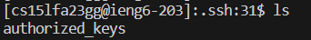
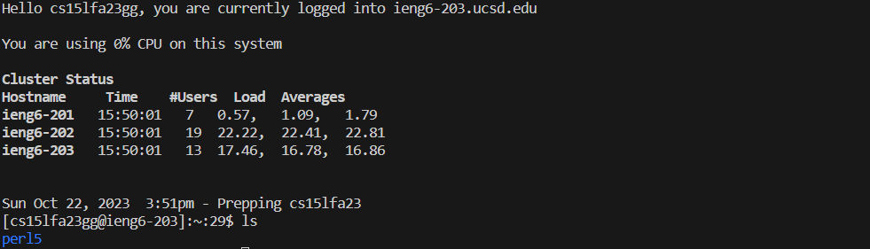

# Lab Report 2
---
## Part One
## `StringServer.java` code

---
## `/add-message` Example one

- Which methods in your code are called?
  > The method `handleRequest(URI url)` was called during this use of `/add-message`. 

- What are the relevant arguments to those methods, and the values of any relevant fields of the class?
  > The argument to this method is `http://localhost:4000/add-message?s=Hello%20World` and is assigned to the URI value `url`, other values of the fields in this class are `""` for the String `str` and `0` for the int `requests`.

- How do the values of any relevant fields of the class change from this specific request? If no values got changed, explain why.
  > When this method sees the `/add-message` path, it increments the value of `requests` by one, making its new value `1`. This method also updates the value of `str` to the request number, the string inside the query, and a new line. This makes the new value for str `"1. Hello World \n"`. `url` is not changed at all and is only used to check what if statements should be run with its path and to pass a query into the values in the method.

---
## `/add-message` Example Two

- Which methods in your code are called?
  > The method `handleRequest(URI url)` was called during this use of `/add-message`. 

- What are the relevant arguments to those methods, and the values of any relevant fields of the class?
  > The argument to this method is `http://localhost:4000/add-message?s=Xylophone` and is assigned to the URI value `url`, and the values of the fields in this class are `"1. Hello World \n 2. I am Ethan \n 3. Third String"` for the String `str` and `3` for the int `requests`.

- How do the values of any relevant fields of the class change from this specific request? If no values got changed, explain why.
  > When this method sees the `/add-message` path, it increments the value of `requests` by one, making its new value `4`. This method also updates the value of `str` to add the request number, the string inside the query, and a new line. This makes the new value for str `"1. Hello World \n 2. I am Ethan \n 3. Third String \n 4. Xylophone"`. `url` is not changed at all and is only used to check what if statements should be run with its path and to pass a query into the values in the method.
  
---
## Part 2
## Path to the private key for my SSH key for logging into ieng6

## Path to the public key for my SSH key for logging into ieng6

## A terminal interaction logged into ieng6 without being asked for a password

---
## Part 3
In these past labs, I have learned how to remotely access a computer using the `ssh` command. This allows me to access the files on a computer without physically being there. This action requires a password unless a key is set up from a remote device, which I have also learned how to do in these past labs.

