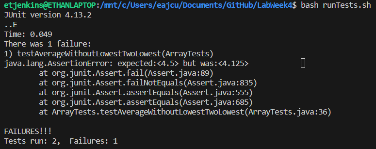

# Lab Report 3
---
## Part One - Bugs
## Associated Code
```java
public class ArrayExamples {
  static double averageWithoutLowest(double[] arr) {
    if(arr.length < 2) { return 0.0; }
    double lowest = arr[0];
    for(double num: arr) {
      if(num < lowest) { lowest = num; }
    }
    double sum = 0;
    for(double num: arr) {
      if(num != lowest) { sum += num; }
    }
    return sum / (arr.length - 1);
  }
}
```
## Failure Inducing Input
```java
 @Test
 public void testAverageWithoutLowestTwoLowest() {
   double[] input = {1.5, 3.0, 5.0, 8.5, 1.5};
   assertEquals(4.5, ArrayExamples.averageWithoutLowest(input), 0.00001);
 }
```
## Non-Failure Inuducing Input
```java
@Test
 public void testAverageWithoutLowestOneLowest() {
   double[] input = {1.5, 2.0, 4.5, 8.5};
   assertEquals(5.0, ArrayExamples.averageWithoutLowest(input), 0.00001);
 }
```
## Symptom

## The fix of the bug
### Before:
```java
public class ArrayExamples {
  static double averageWithoutLowest(double[] arr) {
    if(arr.length < 2) { return 0.0; }
    double lowest = arr[0];
    for(double num: arr) {
      if(num < lowest) { lowest = num; }
    }
    double sum = 0;
    for(double num: arr) {
      if(num != lowest) { sum += num; }
    }
    return sum / (arr.length - 1);
  }
}
```
### After:
```java
public class ArrayExamples {
  static double averageWithoutLowest(double[] arr) {
    if(arr.length < 2) { return 0.0; }
    double lowestIndex = 0;
    for(int i = 0; i < arr.length; i++) {
      if(arr[i] < arr[loewstIndex]) { lowestIndex = i; }
    }
    double sum = 0;
    for(int i = 0; i < arr.length; i++) {
      if(i != lowestIndex) { sum += num; }
    }
    return sum / (arr.length - 1);
  }
  }
}
```
This fix stores the index of the lowest value instead of the value itself. This allows the program to only remove the one lowest number it picks instead of every number that has that same value.
## Part Two - `grep` research
## `-e` option
### Directory:
```
etjenkins@ETHANLAPTOP:/mnt/c/Users/eajcu/Documents/VS Code Files/docsearch/technical$ grep -r -e inseminate -e ultrastructural biomed
biomed/1471-2121-2-10.txt:          We have performed ultrastructural analysis by SEM of
biomed/1471-2121-2-10.txt:          ultrastructural features of the cytoskeleton,
biomed/1471-2121-2-22.txt:        ultrastructural immunogold labeling techniques especially
                                --- A lot of lines ---
biomed/1472-6793-2-17.txt:          thin filaments and had many of the ultrastructural
biomed/1472-6793-2-17.txt:          The overall ultrastructural organization of the
```
This option used with a directory searches through every line in every file in the directory returning lines that either have the string "inseminate" OR "ultrastructural". This is useful because it allows us to search for multiple strings in just one command line.
#### Source: https://linuxopsys.com/topics/grep-command-in-linux

### File:
```
etjenkins@ETHANLAPTOP:/mnt/c/Users/eajcu/Documents/VS Code Files/docsearch/technical$ grep -e interventions -e clinical biomed/1468-6708-3-1.txt
        whom risk factors, subclinical disease, and morbidity are
        modification interventions in older adults.
        significantly greater than zero. A clinical trial of a
          Implications for clinical trials
          interventions for older adults who were merely overweight
          would appear to be fruitless since the interventions
          outcome in evaluations of interventions such as diet or
          interventions such as weight-loss drugs may be harmful [
          outcome measure. Both YOL and YHL would be clinically
        YHL as the outcome measure in clinical trials involving
```
This option used with a file searches through every line a file returning lines that either have the string "interventions" OR "clinical". This is useful because it allows us to search for multiple strings in just one command line.
#### Source: https://linuxopsys.com/topics/grep-command-in-linux

## `-c` option
### Directory:
```
etjenkins@ETHANLAPTOP:/mnt/c/Users/eajcu/Documents/VS Code Files/docsearch/technical$ grep -r -c "clinical" biomed/
biomed/1468-6708-3-1.txt:5
biomed/1468-6708-3-10.txt:12
biomed/1468-6708-3-3.txt:12
biomed/1468-6708-3-4.txt:12
biomed/1468-6708-3-7.txt:6
biomed/1471-2091-2-10.txt:0
  --- A lot of lines ---
biomed/rr37.txt:6
biomed/rr73.txt:0
biomed/rr74.txt:0
```
This option used with a directory returns the number of lines with the string "clinical" for every file in the directory. This can be useful in seeing which files uses a specific word the most or least.
#### Source: https://www.cyberciti.biz/faq/howto-use-grep-command-in-linux-unix/
### File:
```
etjenkins@ETHANLAPTOP:/mnt/c/Users/eajcu/Documents/VS Code Files/docsearch/technical$ grep -c "clinical" biomed/1468-6708-3-1.txt
5
```
This option used with a file returns the number of lines that have the string "clinical" in it. This allows us to count the number of lines a string appears in a file.
#### Source: https://www.cyberciti.biz/faq/howto-use-grep-command-in-linux-unix/

## `-i` option
### Directory:
```
etjenkins@ETHANLAPTOP:/mnt/c/Users/eajcu/Documents/VS Code Files/docsearch/technical$ grep -r -i nocturnin biomed/
biomed/1471-2105-3-37.txt:          5'-polyphosphate phosphatase, Nocturnin, CCR4, cytolethal
biomed/1471-213X-1-9.txt:        nocturnin gene was discovered in a
biomed/1471-213X-1-9.txt:        domain in yeast CCR4 and NOCTURNIN [ 36]. CCR4 is thought
biomed/1471-213X-1-9.txt:        nocturnin was found to exhibit high
biomed/1471-213X-1-9.txt:        nocturnin gene appears to encode a
                        --- A lot of lines ---
biomed/1471-2164-2-9.txt:          Characterization of d.nocturnin and dCCR4 cDNAs was
biomed/1471-2164-2-9.txt:          d.nocturnin:5'-CCGATGGATATTGGAAGCTGGG-3',
biomed/1471-2164-2-9.txt:          both vector and insert. To generate pGa14-m.nocturnin, a
biomed/1471-2164-2-9.txt:          m.nocturnin cDNA [ 21 ]
```
This option with a directory searches every line in every file returning the string "nocturnin" ignoring case sensitivity. This helps us not leave out versions of the word we are searching for that are captialized.
#### Source: https://linuxopsys.com/topics/grep-command-in-linux

### File:
```
etjenkins@ETHANLAPTOP:/mnt/c/Users/eajcu/Documents/VS Code Files/docsearch/technical$ grep -i analysis biomed/1468-6708-3-1.txt
          For this analysis we defined YHL as the number of
          primary analysis we used observed 7-year YOL and YHL when
          this analysis is based.
          Analysis
          intervals or analysis of variance. Finally we calculated
          group were similar. Analysis of mean YOL instead of the
          more traditional survival analysis survival analysis was
        present in the mortality analysis, suggesting that YHL may
```
This option with a file searches every line in the file returning the string "analysis" ignoring case sensitivity. This helps us not leave out versions of the word we are searching for that are captialized.
#### Source: https://linuxopsys.com/topics/grep-command-in-linux

## `-w` option
### Directory:
```
etjenkins@ETHANLAPTOP:/mnt/c/Users/eajcu/Documents/VS Code Files/docsearch/technical$ grep -r -w mNoc biomed/
biomed/1471-213X-1-9.txt:        mNoc ) parallels the pattern seen for
biomed/1471-213X-1-9.txt:          mNoc ) along with partial coding
biomed/1471-213X-1-9.txt:          mNoc mRNA expression. We used
biomed/1471-213X-1-9.txt:          mNoc 3' UTR or from exon II, we
                  --- A lot of lines ---
biomed/1471-213X-1-9.txt:          mNoc clones were custom sequenced
biomed/1471-213X-1-9.txt:          mNoc bacterial artifical chromosome
biomed/1471-213X-1-9.txt:          mNoc were generated using a
biomed/1471-213X-1-9.txt:          mNoc cDNA, forward) and
biomed/1471-213X-1-9.txt:          mNoc ), AF199492 (
```
This option with a directory searches every line in every file for exactly what word is passed without anything before or after but a space. This allows us to narrow our search to a more specific result.
#### Source: https://linuxopsys.com/topics/grep-command-in-linux

### File:
```
etjenkins@ETHANLAPTOP:/mnt/c/Users/eajcu/Documents/VS Code Files/docsearch/technical$ grep -w weight biomed/1468-6708-3-1.txt
        Older adults are frequently counseled to lose weight,
        Many healthy older adults report gradual weight gain
        gradual weight gain is normative and associated with the
        weight standards be adjusted upwards for age [ 8 ] . Such
        trials of weight modification might be more successful if
                    --- A lot of lines ---
          underlying conditions that caused the low weight) could
          be more sensitive to change in weight than EVGFP. If YHL
          differences between the overweight and normal weight
        Recommendations for desirable weight have been
        determine desirable weight guidelines should include
```
This option with a file searches every line in a file for exactly what word is passed without anything before or after but a space. This allows us to narrow our search to a more specific result.
#### Source: https://linuxopsys.com/topics/grep-command-in-linux
