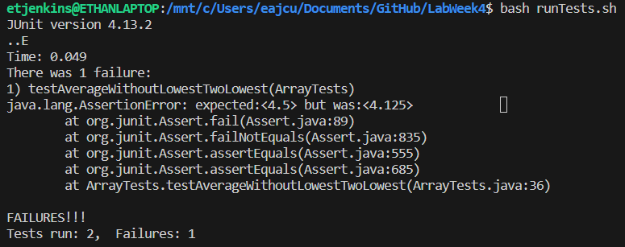

# Lab Report 3
---
## Part One - Bugs
## Associated Code
```java
public class ArrayExamples {
  static double averageWithoutLowest(double[] arr) {
    if(arr.length < 2) { return 0.0; }
    double lowest = arr[0];
    for(double num: arr) {
      if(num < lowest) { lowest = num; }
    }
    double sum = 0;
    for(double num: arr) {
      if(num != lowest) { sum += num; }
    }
    return sum / (arr.length - 1);
  }
}
```
## Failure Inducing Input
```java
 @Test
 public void testAverageWithoutLowestTwoLowest() {
   double[] input = {1.5, 3.0, 5.0, 8.5, 1.5};
   assertEquals(4.5, ArrayExamples.averageWithoutLowest(input), 0.00001);
 }
```
## Non-Failure Inuducing Input
```java
@Test
 public void testAverageWithoutLowestOneLowest() {
   double[] input = {1.5, 2.0, 4.5, 8.5};
   assertEquals(5.0, ArrayExamples.averageWithoutLowest(input), 0.00001);
 }
```
## Symptom

