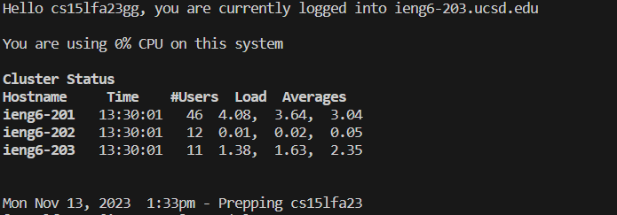
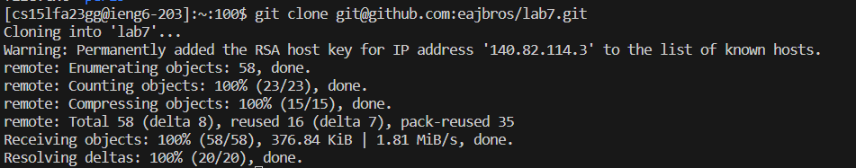
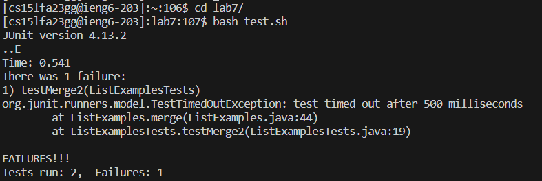
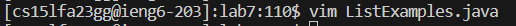
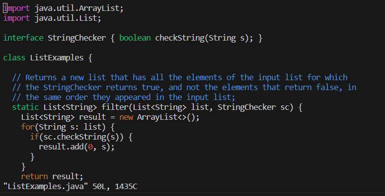
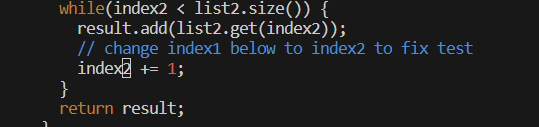
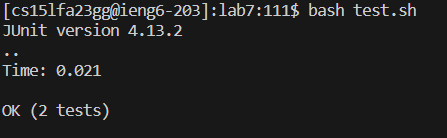
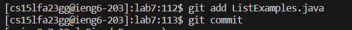
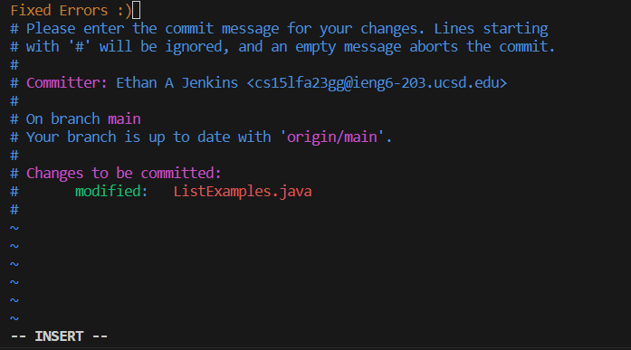
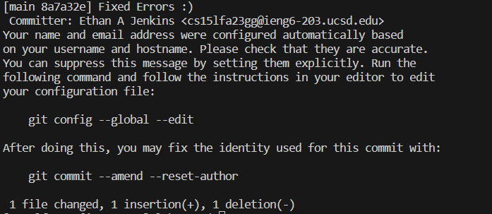

# Lab Report 4
## Step 4: Log into ieng6

Keys Pressed: `<up>` `<enter>`

Description: The command `$ ssh cs15lfa23gg@ieng6.ucsd.edu` was one up in the history of my bash terminal and I used the up arrow to access it.

## Step 5: Clone your fork of the repository from your Github account

Keys Pressed: `g` `i` `t` `<space>` `c` `l` `o` `n` `e` `<space>` `<ctrl>` `v` `<enter`

Description: The ssh url for my fork of the `lab7` repository was already copied to my clipboard so I used paste to input it into the command.

## Step 6: Run the tests, demonstrating that they fail

Keys Pressed: `c` `d` `<space>` `l` `<tab>` `<enter>` `b` `a` `s` `h` `<space>` `t` `<tab>` `<enter>`

Description: I changed my directory into the lab7 directory by typing `cd l` used `tab` to autocomplete the command. I also ran the tests by typing `bash t` and autocompleting the command with `tab`.

## Step 7: Edit the code file to fix the failing test

Keys Pressed: `v` `i` `m` `<space>` `<shift>` `l` `<tab>` `.` `<tab>` `<enter>`

Description: To open vim i typed `vim L` and used tab to autocomplete most of the command. It didn't comlete the whole file because both `ListExamples.java` and `ListExamplesTests.java` can be opened with vim. I added a `.` to show I wanted to access `ListExamples.java` and then completed the command with `tab`.

Keys Pressed: `4` `4` `<shift>` `g` `e` `c` `w` `2` `<esc>` `:` `w` `q` `<enter>`

Description: To get to the line with the error I used `44G` to get to the 44th line. Then I used `e` to get to the end of the word where the error was. The I used `cw` to delete the character I was on and to enter insert mode. I typed `2` to fix the error and saved my work by entering normal mode with `<esc>` and typing `:wq`.

## Step 8: Run the tests, demonstrating that they now succeed

Keys Pressed: `<up>` `<up>` `<enter>`

Description: To rerun the tests I accessed the command by going back up two times into my history to run the same command again and pressed enter.

## Step 9: Commit and push the resulting change to your Github account

Keys Pressed: `g` `i` `t` `<space>` `a` `d` `d` `<space>` `<shift>` `l` `<tab>` `<enter>` `g` `i` `t` `<space>` `c` `o` `m` `<tab>` `<enter>`

Description: I added the `ListExamples.java` file to the staging area by typing `git add L` and autocompleting it with `<tab>`. I then commited by typing `git com` and autocompleted it with `<tab>`.

Keys Pressed: `i` `Fixed Errors :)` `<esc>` `:` `w` `q` `<enter>`
Description: I entered insert mode by typing `i` and added the message `Fixed Errors :)` and saved by entering normal mode with `<esc>` and typed `:wq`.
