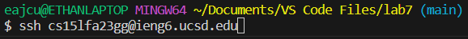

# Lab Report 4
## Step 4: Log into ieng6

Keys Pressed: `<up>` `<enter>`

Description: The command `$ ssh cs15lfa23gg@ieng6.ucsd.edu` was one up in the history of my bash terminal and I used the up arrow to access it.

## Step 5: Clone your fork of the repository from your Github account

