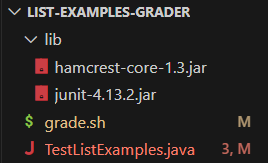
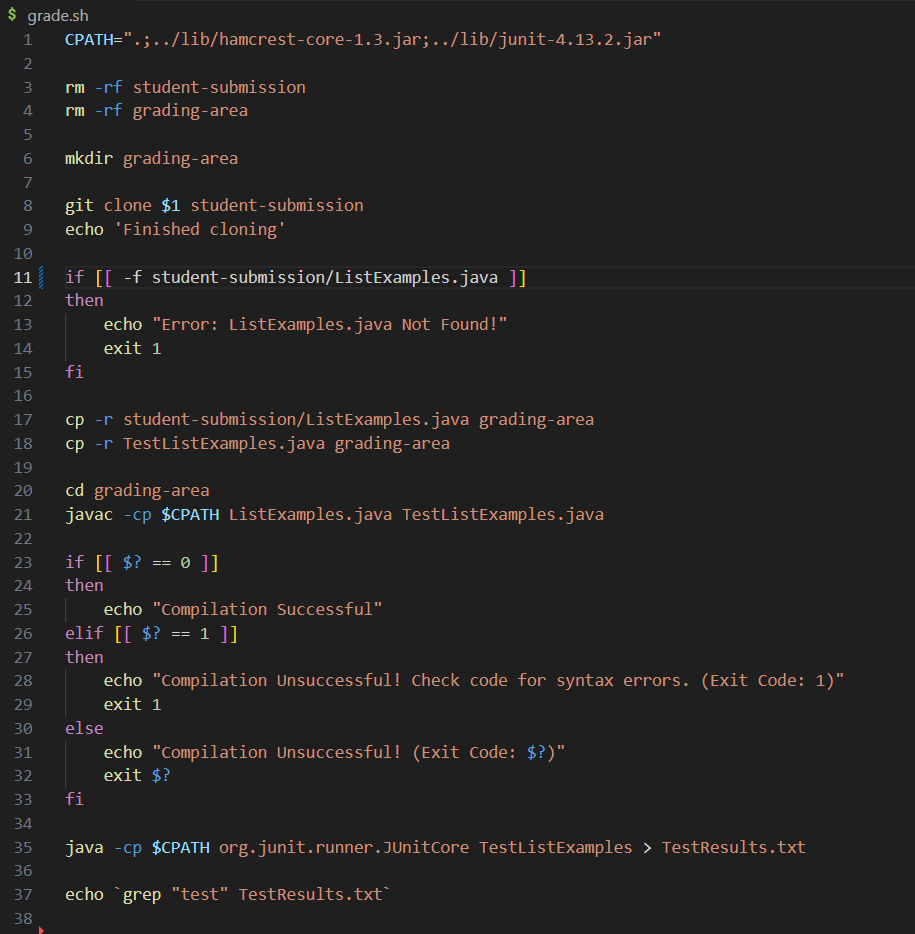
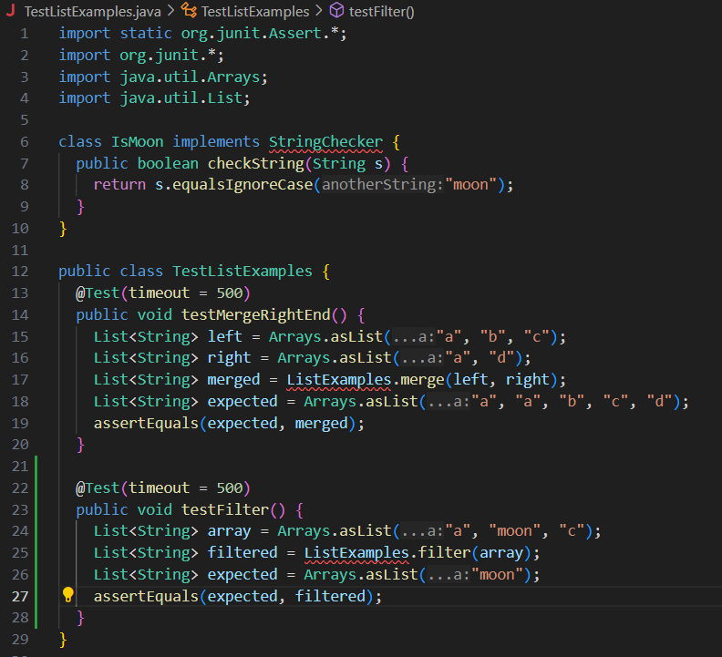

# Lab Report 4
## Part 1 - Debugging Scenario
## Original Post
```
Ethan Jenkins: Hello! I am having trouble running by `grade.sh` script. Every time I try putting in any repository,
it says that the file is not found even when it should be there. It is able to clone the repository, but it never
gets to compiling. Can someone help with this problem? Thanks! Here's a screenshot of the symptom below:
```


## TA Response
```
Ethan Jenkins (but the TA): Hi Ethan! It looks like you might have a problem with the conditional checking the
file submitted. Try this link here: https://github.com/ucsd-cse15l-f22/list-methods-filename, it should have
an incorrect filename. Let me know what happens.
```
## Student Response
```
Ethan Jenkins: Here's what the output of the terminal was when running that repository:
```

```
I noticed that this time, it made it to the compiling part of the code instead of exiting when the file wasn't
found like it should be. I checked the conditional statement to check if a file exists and found that I was missing
a `!` to check if the file doesnt exist. Therefore, an exit code was run when the needed file existed, and the script
would continue when the needed file didn't exist. Thank you for the help!
```
## Information about setup:
### File and directory structure of grading script:
For the grading script structure, you need the lib folder for JUnit, the grading script, and the tests to run on ListExamples.java


### Contents of Grade.sh (with bug):
Runs a ListExamples files methods (filter and merge), if the file exists and compiles. Outputs the results of the tests in a .txt file.


### Contents of TestListExamples.java:
Has two methods that test each of the methods in ListExamples with JUnit.


### Input Repository:
All that is needed in the repository structure is the ListExamples.java file with implamentation of the filter and merge methods.


